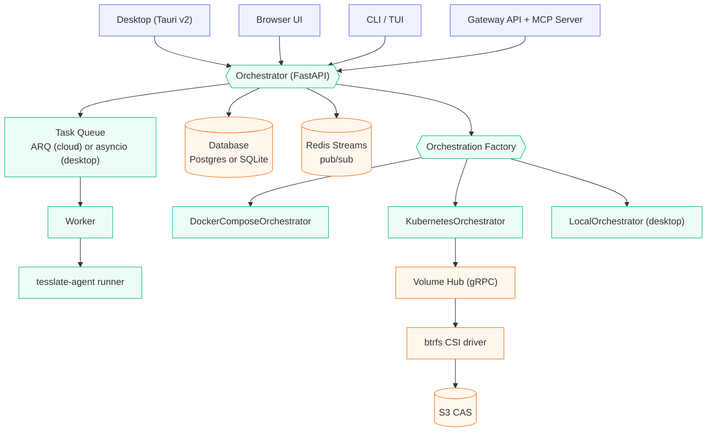

## Overview

OpenSail is an AI-powered platform for building, running, and sharing agents, full-stack apps, scheduled jobs, webhook handlers, and MCP tools. The system is modular: the same orchestrator drives desktop, Docker, and Kubernetes modes by swapping task queue, pub/sub, database, and container backends behind protocols.

This page explains how the components fit together, how data flows at runtime, and how the security model is enforced.

## High-level diagram

## Component layers

<Tabs>
  <Tab title="Frontend">
    | Module | Source | Notes |
    |--------|--------|-------|
    | App shell | `app/src/App.tsx` | React 19 router |
    | API client | `app/src/lib/api.ts` | SSE + fetch wrapper |
    | Editor | Monaco | code + diff view |
    | Chat | `app/src/components/chat/` | agent message stream |
    | Architecture Panel | React Flow | authors `.tesslate/config.json` |
    | Kanban | drag-and-drop board |
  </Tab>

  <Tab title="Desktop shell">
    Tauri v2 Rust shell wraps a PyInstaller-frozen FastAPI sidecar. See `desktop/src-tauri/` and `desktop/sidecar/`.

    - Per-launch bearer token minted on startup
    - SQLite database under `OPENSAIL_HOME`
    - System tray keeps the sidecar alive when the window closes
    - Stronghold stores long-lived `tsk_` pairing keys
    - Deep-link handler for OAuth pairing callbacks
  </Tab>

  <Tab title="Orchestrator">
    | Module | Purpose |
    |--------|---------|
    | `main.py` | Middleware, router mounting, CORS, CSRF |
    | `config.py` | Pydantic settings (env reader) |
    | `models.py` | 45+ SQLAlchemy models |
    | `routers/` | REST endpoints (projects, chat, billing, apps, etc.) |
    | `services/` | Business logic |
    | `agent/` | Legacy inline agent (still used in cloud path) |
    | `worker.py` | ARQ worker entrypoint |
  </Tab>

  <Tab title="Agent runner">
    `packages/tesslate-agent` is the primary agent runner used by both desktop and cloud workers. It provides:

    - A tool registry (read/write, edit, bash, session, web search, fetch, skill loader, kanban, schedule, project control)
    - Progressive persistence: every `AgentStep` is written as it happens
    - Context compaction: older messages roll up via a cheap summarizer
    - Approval gates: tools can require human approval via permission policies
    - Cost and iteration caps (`AGENT_MAX_COST`, `AGENT_MAX_ITERATIONS`)
  </Tab>
</Tabs>

## Deployment modes

| Mode | Database | Queue | Pub/sub | Containers | Best for |
|------|----------|-------|---------|------------|----------|
| Desktop | SQLite (aiosqlite) | asyncio + apscheduler | in-process | subprocess / docker / remote k8s | Single user |
| Docker | Postgres | ARQ on Redis | Redis Streams | Docker Compose | Dev, small teams |
| Kubernetes | Postgres (cloud: RDS) | ARQ on Redis | Redis Streams | per-project namespaces | Multi-tenant prod |

All three are selected by `DEPLOYMENT_MODE` and wired via factories in `orchestrator/app/services/`.

## Three-tier compute model

The AI agent does not need a full Kubernetes pod every time it reads a file. OpenSail separates operations by cost:

| Tier | What runs here | Backend | Wake time |
|------|----------------|---------|-----------|
| Tier 0 | File ops, web calls, agent reasoning | In-process in the worker (FileOps gRPC to CSI) | Near zero |
| Tier 1 | Shell commands | Warm ephemeral containers from a pool | Sub-second |
| Tier 2 | Full dev environment: multi-container project, live preview, deploys | K8s namespace with multiple Deployments | On demand, hibernates when idle |

About 99% of agent operations run on Tier 0 or Tier 1. Tier 2 is only needed when the user is actively working in the workspace or the agent needs to run the full stack.

Hibernation is volume-level: a project snapshot captures the entire btrfs subvolume, then the namespace is torn down. Restore re-hydrates from CAS and brings all containers back together.

## Storage: btrfs CSI and Volume Hub

User project data lives on btrfs subvolumes managed by a two-layer system.

<Tabs>
  <Tab title="btrfs CSI driver">
    Location: `services/btrfs-csi/`.

    Runs as a DaemonSet. Responsibilities:

    - Create btrfs subvolumes (instant snapshot-clone from templates)
    - FileOps gRPC for agent Tier 0 file operations
    - NodeOps gRPC for template builds
    - S3 sync via CAS (content-addressed storage)
    - Per-node garbage collection
  </Tab>

  <Tab title="Volume Hub">
    Location: `services/btrfs-csi/pkg/volumehub/`.

    Single-pod storageless orchestrator. Responsibilities:

    - Track volume ownership and cache placement
    - Pick the best node for each project
    - Coordinate peer-transfer when a volume migrates nodes
    - Trigger S3 sync on hibernation
    - Expose gRPC (`CreateVolume`, `DeleteVolume`, `EnsureCached`, `TriggerSync`, `CreateServiceVolume`, `VolumeStatus`)
  </Tab>

  <Tab title="Orchestrator client">
    Thin async client at `orchestrator/app/services/volume_manager.py` (calls hub via `hub_client.py`). The orchestrator never touches btrfs directly.

    Lifecycle:

    - Create: Hub picks a node, driver creates the subvolume
    - Compute: pod scheduled on `cache_node`, hostPath-mount
    - Hibernate: S3 sync triggered, pod removed, volume cached on node
    - Restore: `EnsureCached` tries fast local path, then peer-transfer, then S3 restore
    - Timeline: up to 5 K8s VolumeSnapshots per project
  </Tab>
</Tabs>

## Agent runner integration

The orchestrator enqueues an `AgentTaskPayload` built from project state, chat history, git status, and `TESSLATE.md`. The ARQ worker picks up the task and runs the `tesslate-agent` loop.

<Steps>
  <Step title="Acquire lock">
    Redis-based distributed lock prevents concurrent runs on the same project.
  </Step>

  <Step title="Loop">
    Each iteration: run the agent, persist `AgentStep` rows, publish events to the Redis Stream, check for a cancellation signal.
  </Step>

  <Step title="Stream to client">
    The API router subscribes to the stream and forwards events over SSE or WebSocket. The client renders steps in real time.
  </Step>

  <Step title="Finalize">
    On completion: write the final Message, release the lock, optionally fire a webhook for external agent callers.
  </Step>
</Steps>

Progressive persistence means pods can die, browsers can close, and the session is resumable.

## Apps subsystem

An app on OpenSail is a versioned, immutable, manifest-described bundle produced from a workspace. Models:

| Model | Role |
|-------|------|
| `MarketplaceApp` | Identity anchor (slug, creator, category, state) |
| `AppVersion` | Immutable version with manifest, CAS bundle address, approval state |
| `AppInstance` | Per-user install with wallet mix and update policy |
| `AppSubmission` | Staged approval pipeline row (stage0 → stage3 → approved) |
| `YankRequest` | Unpublish flow; critical severity requires two admins |
| `AppBundle` | Curated pack of AppVersions |

Services: `installer.py`, `publisher.py`, `submissions.py`, `yanks.py`, `runtime.py`, `stage1_scanner.py`, `stage2_sandbox.py`. See the [Publishing Apps guide](/guides/publishing-apps).

## Channels and gateway

Messaging integrations live under `orchestrator/app/services/channels/` with the Gateway v2 runner at `services/gateway/runner.py`. Platforms: Telegram, Slack, Discord, WhatsApp, Signal, CLI. Identity pairing links platform accounts to OpenSail users. Schedules (cron + timezone) deliver agent output to any configured channel.

See [Communication gateways](/guides/communication-gateways).

## Security model

| Layer | Enforcement |
|-------|-------------|
| Transport | HTTPS in production; Traefik or NGINX Ingress |
| Session | JWT with short-lived access + refresh rotation |
| CSRF | Double-submit cookie with `X-CSRF-Token` header |
| Passwords | bcrypt |
| Secrets at rest | Fernet encryption via `SECRET_KEY`-derived key (`CHANNEL_ENCRYPTION_KEY`, `DEPLOYMENT_ENCRYPTION_KEY`) |
| RBAC | `Team`, `TeamMembership` (admin/editor/viewer), `ProjectMembership` override, `AuditLog` |
| Network isolation (K8s) | `NamespacePerProject` + `NetworkPolicy` enforcing zero cross-project traffic |
| Agent capabilities | `.tesslate/permissions.json` gates shell, network, git push, file writes; approval prompts for `ask` policies |

Every significant action writes to the append-only `AuditLog`, keyed by team and project.

## Next steps

<CardGroup cols={2}>
  <Card title="Configuration" icon="gear" href="/self-hosting/configuration">
    All environment variables with defaults.
  </Card>

  <Card title="Deployment" icon="server" href="/self-hosting/deployment">
    Path-by-path production guides.
  </Card>

  <Card title="Data flow" icon="arrow-right-arrow-left" href="/developer/data-flow">
    Request lifecycle, agent execution, container lifecycle.
  </Card>

  <Card title="Container orchestration" icon="cubes" href="/developer/container-orchestration">
    Three-tier compute, PVC lifecycle, snapshots.
  </Card>
</CardGroup>
